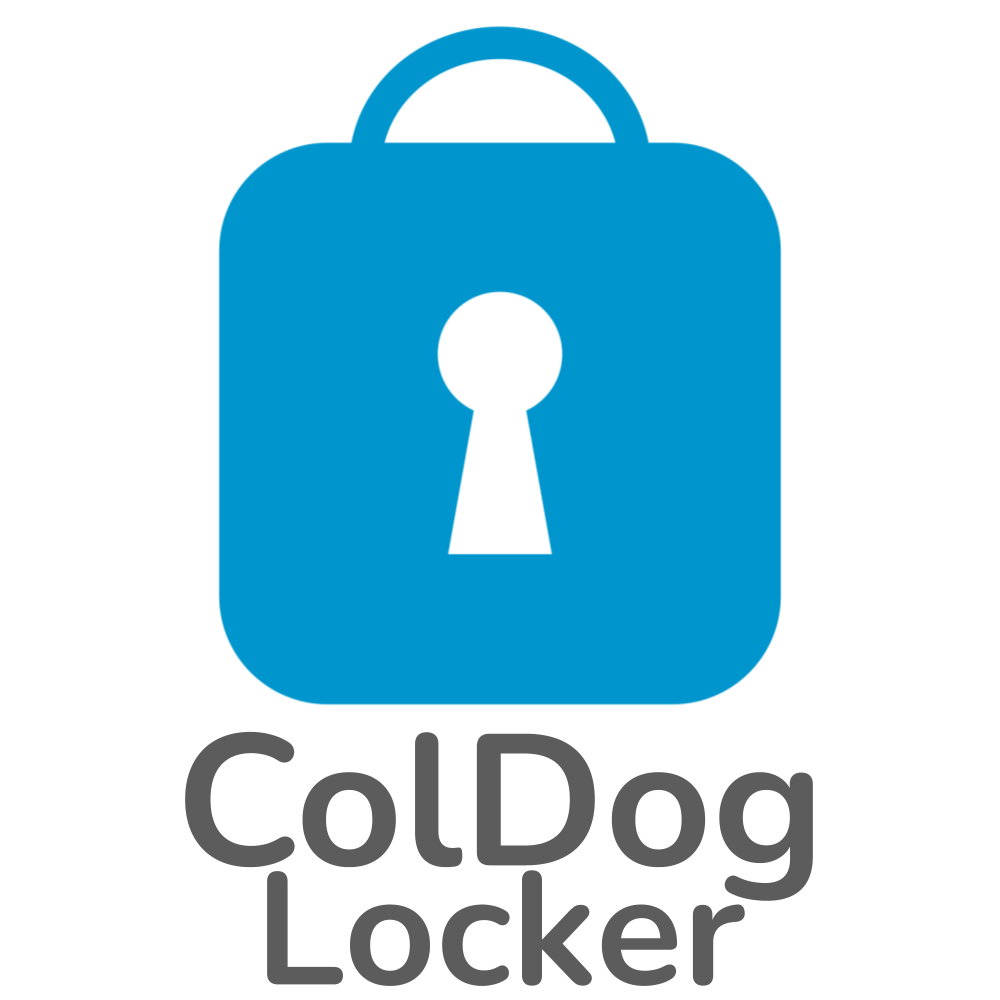

<a name="readme-top"></a>

<!-- PROJECT SHIELDS -->
[![Release][release-shield]][release-url]
[![Downloads][downloads-shield]][downloads-url]
[![Issues][issues-shield]][issues-url]
[![Stargazers][stars-shield]][stars-url]
[![LinkedIn][linkedin-shield]][linkedin-url]


<!-- PROJECT LOGO -->
<br>
<div align="center">
    <a href="https://github.com/ColDogStudios/ColDog-Locke-Lite">
      
    </a>
    
  <p align="center">
    <br>
    <em>Copyright © ColDog Studios. All rights reserved.</em>
    <br>
    <br>
    <a href="https://github.com/ColDogStudios/ColDog-Locker-Lite/tree/CDS/docs"><strong>Explore the docs »</strong></a>
    <br>
    <br>
    <a href="https://github.com/ColDogStudios/ColDog-Locker-Lite/issues">Report Bug</a>
    ·
    <a href="https://github.com/ColDogStudios/ColDog-Locker-Lite/issues">Request Feature</a>
  </p>
</div>


<!-- TABLE OF CONTENTS -->
<details>
  <summary>Table of Contents</summary>
  <ol>
    <li>
      <a href="#about-the-project">About The Project</a>
      <ul>
        <li><a href="#built-with">Built With</a></li>
      </ul>
    </li>
    <li>
      <a href="#getting-started">Getting Started</a>
      <ul>
        <li><a href="#important-notice-and-disclaimer">Important Notice and Disclaimer</a></li>
        <li><a href="#securing-coldog-locker-lite">Securing ColDog Locker Lite</a></li>
      </ul>
    </li>
    <li><a href="#features">Features</a></li>
    <li><a href="#contact">Contact</a></li>
  </ol>
</details>


<!-- ABOUT THE PROJECT -->
## About The Project

ColDog Locker Lite is a lightweight and portable version of ColDog Locker.

<p align="right">(<a href="#readme-top">back to top</a>)</p>


### Built With

* [![WindowsTerminal][WindowsTerminal-shield]][WindowsTerminal-url]
* [![PowerShell][PowerShell-shield]][PowerShell-url]
* [![Windows][Windows-shield]][Windows-url]

<p align="right">(<a href="#readme-top">back to top</a>)</p>


<!-- GETTING STARTED -->
## Getting Started

### Important Notice and Disclaimer

ColDog Locker Lite **should NOT** be used in high-security situations. The security of ColDog Locker Lite is enough to keep people that are not advanced in computers from viewing your files.

Your anti-virus will possibly flag ColDog Locker as a virus. This is a false postitive and you need to make an exclusion.

  - By using this software, you agree that ColDog Studios is not held responsible for any data lost, stolen, or accessed.
  - The software is provided as is and without warranty as to its features, functionality, or performance.
  - Any unauthorized copying, distributing, or selling of this solftware without major alterations to the code is prohibited.

### Securing ColDog Locker Lite

1. Open "ColDog Locker Lite" with a text editor
2. Find the default password by pressing **CTRL** & F, type ```password```, and change it to something secure
3. Download [Bat To Exe Converter](https://bat-to-exe-converter-x64.en.softonic.com/) - I personally use it
4. Open ColDog Locker Lite in the Bat to Exe Converter
5. Press the "Convert" button to create a compressed version of ColDog Locker Lite
6. ***Optional*** - Configure the following options

        Icon:               ColDogLockerIcon.ico (Get from GitHub - /assets/images/ColDogLockerIcon.ico)
        Working directory:  Current directory
        Exe-Format:         32 or 64 Bit | Console (Visible)

<p align="right">(<a href="#readme-top">back to top</a>)</p>


<!-- FEATURES -->
## Features

- Password Protected Folder

See the [open issues](https://github.com/ColDogStudios/ColDog-Locker-Lite/issues) for a full list of proposed features (and known issues).

<p align="right">(<a href="#readme-top">back to top</a>)</p>


<!-- CONTACT -->
## Contact

Collin Laney (ColDog5044) - [@ColDog5044](https://twitter.com/ColDog5044) - coldogstudios.business@gmail.com

[![@ColDog5044][twitter-shield]][twitter-url]
[![Collin-Laney][linkedin-shield]][linkedin-url]
[![Email][gmail-shield]][gmail-url]

<p align="right">(<a href="#readme-top">back to top</a>)</p>


<!-- MARKDOWN LINKS & IMAGES -->
[release-shield]: https://img.shields.io/github/v/release/ColDogStudios/ColDog-Locker-Lite.svg?style=for-the-badge
[release-url]: https://github.com/ColDogStudios/ColDog-Locker-Lite
[downloads-shield]: https://img.shields.io/github/downloads/ColDogStudios/ColDog-Locker-Lite/total.svg?style=for-the-badge
[downloads-url]: https://github.com/ColDogStudios/ColDog-Locker-Lite
[issues-shield]: https://img.shields.io/github/issues/ColDogStudios/ColDog-Locker-Lite.svg?style=for-the-badge
[issues-url]: https://github.com/ColDogStudios/ColDog-Locker-Lite/issues
[stars-shield]: https://img.shields.io/github/stars/ColDogStudios/ColDog-Locker-Lite.svg?style=for-the-badge
[stars-url]: https://github.com/ColDogStudios/ColDog-Locker-Lite/stargazers

[github-shield]: https://img.shields.io/badge/github-%23121011.svg?style=for-the-badge&logo=github&logoColor=white
[github-url]: https://github.com/
[twitter-shield]: https://img.shields.io/badge/Twitter-%231DA1F2.svg?style=for-the-badge&logo=Twitter&logoColor=white
[twitter-url]: https://twitter.com/ColDog5044
[linkedin-shield]: https://img.shields.io/badge/linkedin-%230077B5.svg?style=for-the-badge&logo=linkedin&logoColor=white
[linkedin-url]: https://www.linkedin.com/in/collin-laney/
[gmail-shield]: https://img.shields.io/badge/Gmail-D14836?style=for-the-badge&logo=gmail&logoColor=white
[gmail-url]: mailto:coldogstudios.business@gmail.com

[WindowsTerminal-shield]:https://img.shields.io/badge/Windows%20Terminal-%234D4D4D.svg?style=for-the-badge&logo=windows-terminal&logoColor=white
[WindowsTerminal-url]:https://github.com/microsoft/terminal
[PowerShell-shield]:https://img.shields.io/badge/PowerShell-%235391FE.svg?style=for-the-badge&logo=powershell&logoColor=white
[PowerShell-url]: https://docs.microsoft.com/en-us/powershell/
[Windows-shield]: https://img.shields.io/badge/Windows-0078D6?style=for-the-badge&logo=windows&logoColor=white
[Windows-url]: https://www.microsoft.com/en-us/windows
